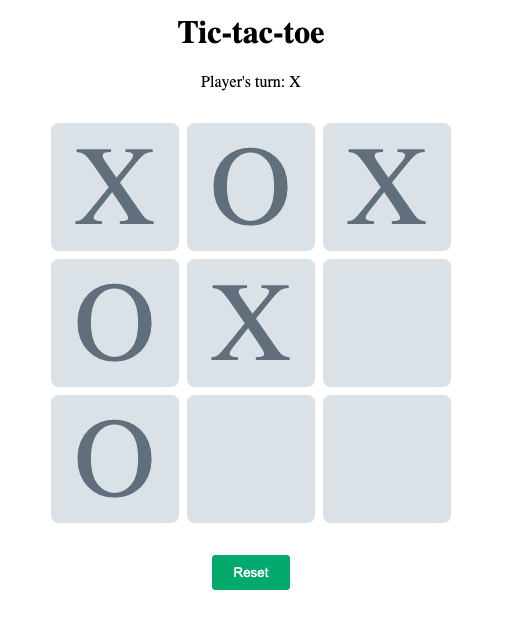

Tic-tac-toe
===========

## Índice
- [Tic-tac-toe](#tic-tac-toe)
  - [Índice](#índice)
    - [Intuíto](#intuíto)
    - [Premissas](#premissas)

### Intuíto
Desafio de codificação do [Jogo da Velha](https://pt.wikipedia.org/wiki/Jogo_da_velha) em Angular.

### Premissas
> É importante que as versões do `npm` e `node` configuradas em seu ambiente sejam compatíveis com as seguintes: 
>  * npm  >= 6.14.15
>  * node >= 14.18.0
>  * angular-cli >= 13.3.0
